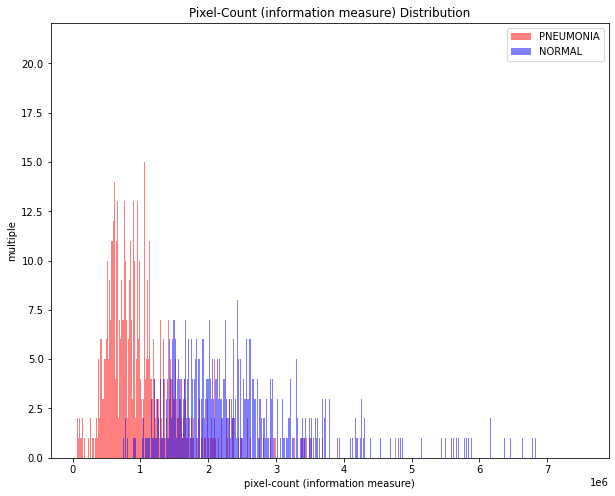
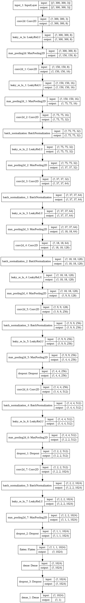
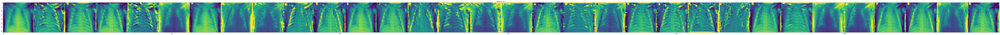

# Module 4 Final Project

**Problem**: *Pediatric Pneumonia X-Ray Image Classification with Deep Learning (Convolutional Neural Network)*

## Organization of Repository

### Jupyter Notebook(s)
There is only one notebook I needed to author for this project: [mod4-project.ipynb](mod4-project.ipynb), in the root directory.

Note that this notebook can and should be opened directly in [Colab](https://colab.research.google.com/github/sacontreras/dsc-mod-4-project-v2-1-online-ds-sp-000/blob/master/mod4-project.ipynb) since the GPU runtime can be used if you wish to re-run the entire process yourself.  Without GPU, training will take a very long time.

### Model Files
The model I create and train in [mod4-project.ipynb](mod4-project.ipynb) has been saved at two checkpoints:
- the one with the best (highest) *validation accuracy* has been saved to [best_val_acc_model.hdf5](best_val_acc_model.hdf5)
- the one with the best (lowest) *validation loss* has been saved to [best_val_loss_model.hdf5](best_val_loss_model.hdf5)

### Remaining Files (images)
The remaining files are just images I used in my [ExecutiveSummary.pdf](ExecutiveSummary.pdf).

## OVERVIEW and SUMMARY of RESULTS

### Notice
To re-run the notebook, please pull down the Colab **Runtime** menu and select **Change runtime type**.  This will bring up the **Notebook settings** window.  Change **Hardware accelerator** to **GPU** and click **Save**.  This will reset the notebook and the VM.  All local files (downloaded images and augmented images) will be removed since this also resets the VM's file system.  But training will take a very long time unless this is done.

    Number of replicas: 1
    Using Tensorflow verion 2.3.0

### Download images if we haven't already...

    ./CellData already exists locally - skipping download

### Explore the Dataset

    total training images: 5232
    	NORMAL: 1349 (0.26)
    	PNEUMONIA: 3883 (0.74)
    
    total test images: 624
    	NORMAL: 234 (0.38)
    	PNEUMONIA: 0.625 (0.62)

#### Sample visualization of the X-ray training images

Note: set `img_idx_offset = None` and re-run to view a different (random) batch of training images

    

    

#### Get a feel for the distribution of image shapes

    

    

    

    

    mean image shape/information-content:
    	overall: 974 x 1328
    	PNEUMONIA: 819 x 1195 (978705 mean pixel-count * 4273 images = 4182006465)
    	NORMAL: 1391 x 1688 (2348008 pixels, 1583 images = 3716896664)
    
    Relative "information" contained in this dataset: PNEUMONIA:NORMAL = 1.1251339068704334:1
    
    smallest image: ((127, 384), './CellData/chest_xray/train/PNEUMONIA/VIRUS-355597-0002.jpeg')

    

    

    
    biggest image: ((2583, 2916), './CellData/chest_xray/train/NORMAL/NORMAL-9990348-0001.jpeg')

    

    

From the above, we conclude that, in general, ground-positive (Pneumonia) images are smaller than ground-negative (Normal, non-pneumonia) images.

Additionally, there is a class imbalance observed: there are more ground-positive images than ground-negative images.  We will need to account for this imbalance during training.

### Create datasets from images

#### First we will use *image augmentation* to "enlarge" the final training set (uing `ImageDataGenerator`)

New (augmented) training images will be created from existing ones, via the following image transformations:
- rotation
- horizontal translation
- vertical translation
- shearing
- zooming
- flipping horizontally (along the vertical axis)

    augmenting 337 random images from ./CellData/chest_xray/train/NORMAL...
    	ALL DONE! Augmented images have been created in ./CellData/chest_xray/train-aug/NORMAL
    augmenting 970 random images from ./CellData/chest_xray/train/PNEUMONIA...
    	ALL DONE! Augmented images have been created in ./CellData/chest_xray/train-aug/PNEUMONIA

#### Sample visualization of *augmented* training images

    

    

#### Copy source training images into the augmented training images directory

    total (augmented + original) training images: 6492
    	NORMAL: 1684 (0.26)
    	PNEUMONIA: 4808 (0.74)

### Build the Convolutional Neural Network

The following functions simplify/condense the code-representation of the CNN's architecture.

The idea is for the CNN to become increasingly discerning with magnification of each subsequent convolution, proceeding from general to specific.

    Model: "functional_1"
    _________________________________________________________________
    Layer (type)                 Output Shape              Param #   
    =================================================================
    input_1 (InputLayer)         [(None, 300, 300, 3)]     0         
    _________________________________________________________________
    conv2d (Conv2D)              (None, 300, 300, 8)       224       
    _________________________________________________________________
    leaky_re_lu (LeakyReLU)      (None, 300, 300, 8)       0         
    _________________________________________________________________
    max_pooling2d (MaxPooling2D) (None, 150, 150, 8)       0         
    _________________________________________________________________
    conv2d_1 (Conv2D)            (None, 150, 150, 16)      1168      
    _________________________________________________________________
    leaky_re_lu_1 (LeakyReLU)    (None, 150, 150, 16)      0         
    _________________________________________________________________
    max_pooling2d_1 (MaxPooling2 (None, 75, 75, 16)        0         
    _________________________________________________________________
    conv2d_2 (Conv2D)            (None, 75, 75, 32)        4640      
    _________________________________________________________________
    batch_normalization (BatchNo (None, 75, 75, 32)        128       
    _________________________________________________________________
    leaky_re_lu_2 (LeakyReLU)    (None, 75, 75, 32)        0         
    _________________________________________________________________
    max_pooling2d_2 (MaxPooling2 (None, 37, 37, 32)        0         
    _________________________________________________________________
    conv2d_3 (Conv2D)            (None, 37, 37, 64)        18496     
    _________________________________________________________________
    batch_normalization_1 (Batch (None, 37, 37, 64)        256       
    _________________________________________________________________
    leaky_re_lu_3 (LeakyReLU)    (None, 37, 37, 64)        0         
    _________________________________________________________________
    max_pooling2d_3 (MaxPooling2 (None, 18, 18, 64)        0         
    _________________________________________________________________
    conv2d_4 (Conv2D)            (None, 18, 18, 128)       73856     
    _________________________________________________________________
    batch_normalization_2 (Batch (None, 18, 18, 128)       512       
    _________________________________________________________________
    leaky_re_lu_4 (LeakyReLU)    (None, 18, 18, 128)       0         
    _________________________________________________________________
    max_pooling2d_4 (MaxPooling2 (None, 9, 9, 128)         0         
    _________________________________________________________________
    conv2d_5 (Conv2D)            (None, 9, 9, 256)         295168    
    _________________________________________________________________
    batch_normalization_3 (Batch (None, 9, 9, 256)         1024      
    _________________________________________________________________
    leaky_re_lu_5 (LeakyReLU)    (None, 9, 9, 256)         0         
    _________________________________________________________________
    max_pooling2d_5 (MaxPooling2 (None, 4, 4, 256)         0         
    _________________________________________________________________
    dropout (Dropout)            (None, 4, 4, 256)         0         
    _________________________________________________________________
    conv2d_6 (Conv2D)            (None, 4, 4, 512)         1180160   
    _________________________________________________________________
    batch_normalization_4 (Batch (None, 4, 4, 512)         2048      
    _________________________________________________________________
    leaky_re_lu_6 (LeakyReLU)    (None, 4, 4, 512)         0         
    _________________________________________________________________
    max_pooling2d_6 (MaxPooling2 (None, 2, 2, 512)         0         
    _________________________________________________________________
    dropout_1 (Dropout)          (None, 2, 2, 512)         0         
    _________________________________________________________________
    conv2d_7 (Conv2D)            (None, 2, 2, 1024)        4719616   
    _________________________________________________________________
    batch_normalization_5 (Batch (None, 2, 2, 1024)        4096      
    _________________________________________________________________
    leaky_re_lu_7 (LeakyReLU)    (None, 2, 2, 1024)        0         
    _________________________________________________________________
    max_pooling2d_7 (MaxPooling2 (None, 1, 1, 1024)        0         
    _________________________________________________________________
    dropout_2 (Dropout)          (None, 1, 1, 1024)        0         
    _________________________________________________________________
    flatten (Flatten)            (None, 1024)              0         
    _________________________________________________________________
    dense (Dense)                (None, 1024)              1049600   
    _________________________________________________________________
    dropout_3 (Dropout)          (None, 1024)              0         
    _________________________________________________________________
    dense_1 (Dense)              (None, 1)                 1025      
    =================================================================
    Total params: 7,352,017
    Trainable params: 7,347,985
    Non-trainable params: 4,032
    _________________________________________________________________

    

    

### Consider Class Imbalance

    Class 0 (NORMAL, augmented) weight: 1.73
    Class 1 (PNEUMONIA, augmented) weight: 0.61

    Found 6492 files belonging to 2 classes.
    Using 5843 files for training.
    Found 6492 files belonging to 2 classes.
    Using 649 files for validation.

Now fit the CNN to the training images (dataset).

We will also stop early if we reach better than 95% accuracy.

Additionally, we adopt a performance-based learning-rate scheduler scheme, wherein the learning-rate will be reduced whenever it does not increase for two consecutive epochs.

    Epoch 1/20
    366/366 [==============================] - 82s 223ms/step - loss: 0.3331 - accuracy: 0.8942 - precision: 0.9624 - recall: 0.8915 - val_loss: 10.6100 - val_accuracy: 0.2357 - val_precision: 0.0000e+00 - val_recall: 0.0000e+00
    Epoch 2/20
    366/366 [==============================] - 82s 223ms/step - loss: 0.1635 - accuracy: 0.9315 - precision: 0.9804 - recall: 0.9258 - val_loss: 0.1372 - val_accuracy: 0.9461 - val_precision: 0.9458 - val_recall: 0.9859
    Epoch 3/20
    366/366 [==============================] - ETA: 0s - loss: 0.0952 - accuracy: 0.9613 - precision: 0.9883 - recall: 0.9590
    Epoch 00003: ReduceLROnPlateau reducing learning rate to 0.0006250000296859071.
    366/366 [==============================] - 81s 222ms/step - loss: 0.0952 - accuracy: 0.9613 - precision: 0.9883 - recall: 0.9590 - val_loss: 0.2443 - val_accuracy: 0.9445 - val_precision: 0.9323 - val_recall: 1.0000
    Epoch 4/20
    366/366 [==============================] - 83s 228ms/step - loss: 0.0580 - accuracy: 0.9728 - precision: 0.9917 - recall: 0.9712 - val_loss: 0.1321 - val_accuracy: 0.9522 - val_precision: 0.9979 - val_recall: 0.9395
    Epoch 5/20
    366/366 [==============================] - ETA: 0s - loss: 0.0572 - accuracy: 0.9771 - precision: 0.9932 - recall: 0.9756
    Epoch 00005: ReduceLROnPlateau reducing learning rate to 0.00039062502764863893.
    366/366 [==============================] - 84s 229ms/step - loss: 0.0572 - accuracy: 0.9771 - precision: 0.9932 - recall: 0.9756 - val_loss: 0.1012 - val_accuracy: 0.9738 - val_precision: 0.9938 - val_recall: 0.9718
    Epoch 6/20
    366/366 [==============================] - 83s 228ms/step - loss: 0.0314 - accuracy: 0.9858 - precision: 0.9965 - recall: 0.9842 - val_loss: 0.1624 - val_accuracy: 0.9522 - val_precision: 1.0000 - val_recall: 0.9375
    Epoch 7/20
    366/366 [==============================] - ETA: 0s - loss: 0.0320 - accuracy: 0.9890 - precision: 0.9965 - recall: 0.9886
    Epoch 00007: ReduceLROnPlateau reducing learning rate to 0.00024414064682787284.
    366/366 [==============================] - 84s 230ms/step - loss: 0.0320 - accuracy: 0.9890 - precision: 0.9965 - recall: 0.9886 - val_loss: 4.0413 - val_accuracy: 0.2866 - val_precision: 1.0000 - val_recall: 0.0665
    Epoch 8/20
    366/366 [==============================] - 84s 230ms/step - loss: 0.0442 - accuracy: 0.9808 - precision: 0.9958 - recall: 0.9782 - val_loss: 0.1311 - val_accuracy: 0.9676 - val_precision: 0.9938 - val_recall: 0.9637
    Epoch 9/20
    366/366 [==============================] - ETA: 0s - loss: 0.0146 - accuracy: 0.9937 - precision: 0.9977 - recall: 0.9937
    Epoch 00009: ReduceLROnPlateau reducing learning rate to 0.00015258790881489404.
    
    Reached > 95.0% accuracy and < 0.1% loss (require_validation==True) so canceling training!
    366/366 [==============================] - 84s 229ms/step - loss: 0.0146 - accuracy: 0.9937 - precision: 0.9977 - recall: 0.9937 - val_loss: 0.0942 - val_accuracy: 0.9769 - val_precision: 0.9878 - val_recall: 0.9819

    41/41 [==============================] - 7s 166ms/step - loss: 0.0942 - accuracy: 0.9769 - precision: 0.9878 - recall: 0.9819

    [0.09415492415428162,
     0.9768875241279602,
     0.9878296256065369,
     0.9818548560142517]

    

    

    

    

### Evaluate the model on the Test images

    predicting from source directory: ./CellData/chest_xray/test
    Found 624 files belonging to 2 classes.
    624/624 [==============================] - 9s 15ms/step - loss: 0.5591 - accuracy: 0.8830 - precision: 0.8453 - recall: 0.9949

    

    

    
                  precision    recall  f1-score   support
    
          NORMAL       0.99      0.70      0.82       234
       PNEUMONIA       0.85      0.99      0.91       390
    
        accuracy                           0.88       624
       macro avg       0.92      0.85      0.87       624
    weighted avg       0.90      0.88      0.88       624
    

Obviously, we would prefer to have fewer False Negatives than False Positives in this case, since the goal is to diagnose a potentially fatal medical condition.  Thus, we conclude this is a superior model since it predicts only 2 False out of 234 True Negatives and 71 False out of 390 True Positives from the *Test* set.

### To conclude, visually display an example of how convolutions in the model select features from images

Most of the code within the function below is sourced from from Laurance Moroney's [notebook](github.com/lmoroney/dlaicourse/blob/master/Course%202%20-%20Part%202%20-%20Lesson%202%20-%20Notebook.ipynb#scrollTo=-5tES8rXFjux) he uses to teach his Coursera course.

##### Example 1

    b'./CellData/chest_xray/test/PNEUMONIA/BACTERIA-8285922-0001.jpeg'
    prediction: (1, 'PNEUMONIA')

    

    

    

    

    

    

    

    

    

    

    

    

    

    

    

    

    

    

    

    

    

    

    

    

    

    

    

    

    

    

    

    

    

    

    

    

    

    

    

    

    

    

    

    

    

    

    

    

    

    

    

    

    

    

    

    

    

    

    

    

    

    

    

    

    

    

##### Example 2

    b'./CellData/chest_xray/test/PNEUMONIA/VIRUS-1352878-0004.jpeg'
    prediction: (1, 'PNEUMONIA')

    

    

    

    

    

    

    

    

    

    

    

    

    

    

    

    

    

    

    

    

    

    

    

    

    

    

    

    

    

    

    

    

    

    

    

    

    

    

    

    

    

    

    

    

    

    

    

    

    

    

    

    

    

    

    

    

    

    

    

    

    

    

    

    

    

    

##### Example 3

    predicting from source directory: ./CellData/chest_xray/train
    Found 5232 files belonging to 2 classes.
    5232/5232 [==============================] - 65s 13ms/step - loss: 0.0099 - accuracy: 0.9973 - precision: 0.9992 - recall: 0.9972
    b'./CellData/chest_xray/train/PNEUMONIA/VIRUS-1538177-0006.jpeg'
    prediction: (1, 'PNEUMONIA')

    

    

    

    

    

    

    

    

    

    

    

    

    

    

    

    

    

    

    

    

    

    

    

    

    

    

    

    

    

    

    

    

    

    

    

    

    

    

    

    

    

    

    

    

    

    

    

    

    

    

    

    

    

    

    

    

    

    

    

    

    

    

    

    

    

    

##### Example 4

    b'./CellData/chest_xray/train/PNEUMONIA/BACTERIA-9942581-0001.jpeg'
    prediction: (0, 'NORMAL')

    

    

    

    

    

    

    

    

    

    

    

    

    

    

    

    

    

    

    

    

    

    

    

    

    

    

    

    

    

    

    

    

    

    

    

    

    

    

    

    

    

    

    

    

    

    

    

    

    

    

    

    

    

    

    

    

    

    

    

    

    

    

    

    

    

    

 

### References

Jang, A. (2020). TensorFlow Pneumonia Classification on X-rays. Retrieved 21 October 2020, from https://www.kaggle.com/amyjang/tensorflow-pneumonia-classification-on-x-rays

 
Kermany, D., Goldbaum, M., Cai, W., Lewis, M., Xia, H., & Kng Zhang, K. (2018). Identifying Medical Diagnoses and Treatable Diseases by Image-Based Deep Learning [Ebook]. Cell Press, Elsevier Inc. Retrieved from https://www.cell.com/action/showPdf?pii=S0092-8674%2818%2930154-5

 
Moroney, L. (2020). lmoroney/dlaicourse Course 2 - Part 2 - Lesson 2. Retrieved 21 October 2020, from https://github.com/lmoroney/dlaicourse/blob/master/Course%202%20-%20Part%202%20-%20Lesson%202%20-%20Notebook.ipynb#scrollTo=-5tES8rXFjux

 
Patel, R. (2020). CNN-Pneumonia-Detection. Retrieved 21 October 2020, from https://www.kaggle.com/rujulpatel/cnn-pneumonia-detection
